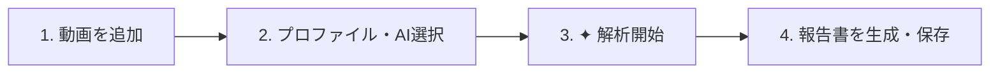

# 🎬 Video Scripter (ビデオ・スクリプター)

> 動画を見直す時間をゼロに。
> AIが映像を自動で観測・分析し、「タイムスタンプ付きの時系列ログ」と「検証可能な報告書・記録」を作成するWebアプリケーションです。
> バイブコーディングです。

---

## 💡 Video Scripter とは？

長い作業動画、セミナー録画、監視カメラ映像などを人間が最初から最後まで確認して記録・報告書を作成するのは大変な手間がかかります。

**Video Scripter** は、動画をアップロードするだけで、AIが映像内の出来事を時系列で自動抽出し、ワンクリックで綺麗な作業報告書や議事録・要約レポートを作成します。

さらに、AIが記録したすべてのイベントには「その瞬間の証拠画像（フレーム写真）」が紐づくため、AIの思い込みや誤りをいつでも目で見て確認できる（検証可能性・Evidence Chain）のが最大の特徴です。

---

## ✨ 主な特徴

### 1. 4つの目的別「解析プロファイル」
用途に合わせて選ぶだけで、AIが注目するポイントや作成するレポートの形式を最適化します。

- 🔧 作業・操作記録 (`operation`)
  - 工場や現場の作業手順、点検、機器操作、PC画面操作などを記録。「誰が・何を・どう操作したか」を正確に洗い出します。マニュアル作成や作業標準化に最適です。
- 🎓 セミナー・研修・教育記録 (`seminar_education`)
  - 講義や研修、ウェビナー動画向け。アジェンダの進行、スライドの要点、実演デモ、質疑応答を整理し、講義録や要約を作成します。
- 🏞️ 状況記録 (`situation`)
  - 定点カメラや風景・環境映像向け。全体の状況変化、人物や物体の動き、発生したイベントの概要を整理・構造化します。
- ✨ カスタム (`custom`)
  - 「作業者の手の動きだけに注目して」「英語で出力して」など、抽出の観点や報告書の形式を自由に入力できます。

### 2. 根拠が残るから安心（Evidence Chain）
AIが「〇分〇秒に〇〇を実施」と出力した記録には、すべて動画から切り出した根拠フレーム画像へのリンクが付きます。  
ワンクリックでその瞬間の写真を確認できるため、業務利用でも安心して採用できます。

### 3. 安心・便利な「中断」と「再開」機能
- 長い動画の解析中に一時停止したいときは、いつでも「⏸ 中断」できます。
- 中断した進捗は保存され、「▶ 解析を再開」を押せば続きの区間からすぐに再開できます。
- 不要になった処理は「⏹ キャンセル」でいつでも安全に中止できます。

### 4. お好みのAIを選択可能（クラウドから完全ローカルまで）
利用環境やセキュリティポリシーに応じて、4大AIプロバイダーを自由に切り替えて使用できます。

【注意】OpenAI、Anthropic、Googleは、APIを利用します。長時間の動画解析は、大量のトークンを消費するので、ローカルLLMの利用を推奨します。

| AIプロバイダー | 特徴 | こんな方におすすめ |
|---|---|---|
| **LM Studio** | お使いのPC内でAIを動かす**完全ローカル・オフライン対応** | 機密動画や社外秘データを外部に一切送信したくない |
| **OpenAI (ChatGPT)** | 安定した画像認識と構造化データ抽出 | 標準的なGPTモデルを活用したい |
| **Anthropic (Claude)** | 日本語の文章作成能力が非常に高く、高品質な報告書を生成 | 読みやすく洗練されたレポートを作成したい |
| **Google (Gemini)** | 動画の直接送信に対応。高速かつ長尺動画に強い | クラウドの最新AIで手軽に高速解析したい |

---

## 🚀 かんたん4ステップの使い方



1. **動画を追加する**:
   - プロジェクトを作成し、解析したい動画ファイルをドラッグ＆ドロップまたは選択してアップロードします。
2. **目的とAIを選ぶ**:
   - 画面上のドロップダウンから「解析プロファイル（作業記録、セミナー記録など）」と「AIプロバイダー」を選びます。
3. **「✦ 解析開始」をクリック**:
   - AIが動画を解析し、時系列のイベントリストがリアルタイムで画面に並びます。（途中で一時停止・再開も可能）
4. **「報告書・記録を生成」をクリック**:
   - 画面下部に生成された報告書・記録が表示されます。
   - 抽出されたイベントを元に、見出しや箇条書きで整理された完成版レポートを作成します。Markdownファイルとしてダウンロード可能です。

---

## 🛠️ 動作に必要な環境

- **Node.js**: `v22.13` 以上
- **FFmpeg**: 動画のメタデータ取得・静止画フレーム抽出に使用
  - **Windows**: コマンドプロンプト等で `winget install Gyan.FFmpeg`
  - **macOS**: ターミナルで `brew install ffmpeg`
  - **Linux (Ubuntu/Debian)**: `sudo apt update && sudo apt install ffmpeg`
- **使用したいAIのアカウント / APIキー**（いずれか1つ以上）:
  - Google Gemini API Key（無料枠あり）
  - Anthropic API Key
  - OpenAI API Key
  - または [LM Studio](https://lmstudio.ai/)（Vision対応モデルをダウンロードしてローカルサーバーを起動）

---

## 📦 インストールと起動手順

### 1. リポジトリの準備
```bash
git clone https://github.com/h-sugah/Video_Scripter.git
cd Video_Scripter
```

### 2. インストールとビルド
```bash
npm install
npm run build
```

### 3. アプリケーションの起動
```bash
npm run start
```
*(開発モードで起動したい場合は `npm run dev`)*

### 4. ブラウザでアクセス
ブラウザを開き、以下のアドレスにアクセスします：
👉 **http://localhost:5173**

---

## ⚙️ 初期設定（APIキーの登録）

アプリ右上の **「⚙ 設定・プロファイル」** ボタンから設定画面を開きます。

1. **AIプロバイダー設定**:
   - 使用したいAI（LM Studio / OpenAI / Claude / Gemini）を選択します。
   - お手持ちのAPIキーを入力し、「**🔄 接続を確認・モデル一覧を取得**」をクリックして接続を確認します。
   - 使用モデルから使いたいモデルを選択します。
2. **設定を保存**:
   - 「設定を保存」をクリックすれば準備完了です。

> **🔒 セキュリティとプライバシーについて**  
> 登録したAPIキーやアップロードした動画、解析結果はすべてお使いのPC内（`data/` ディレクトリ内のローカルSQLiteデータベース）に安全に保存されます。開発元や第三者のサーバーへ勝手に送信されることはありません。

---

## 📁 データの管理場所

本アプリのデータはすべてプロジェクトフォルダ直下の `data/` に保存されます。

- `data/uploads/`: アップロードされた動画ファイル
- `data/frames/`: 解析用に抽出された静止画フレーム画像
- `data/video-scripter.sqlite`: プロジェクト・解析イベント・報告書・設定を保持するデータベースファイル
- `data/lan-auth-token`: LAN公開モード有効時にのみ生成される、LANアクセス用の認証トークン

---

## 🌐 LAN公開モード（同一ネットワーク内の他端末からのアクセス）

デフォルトでは、本アプリは `127.0.0.1`（localhost）にのみ待ち受け、この端末以外からはアクセスできません。同一LAN内の他のPC・スマートフォンからもアクセスしたい場合は、以下の手順でLAN公開モードを有効化できます。

```bash
HOST=0.0.0.0 npm run start
```

`HOST` にループバック以外のアドレスを指定すると自動的にLAN公開モードになり、次のセキュリティ機構が有効になります。

1. **トークン認証**: 初回起動時にランダムな認証トークンが生成され、コンソールと `data/lan-auth-token` に出力されます。LAN上の他端末からアクセスすると、このトークンの入力を求めるログイン画面が表示されます（この端末自身から `http://127.0.0.1:<port>` でアクセスする場合は、従来どおりトークン入力なしで利用できます）。
2. **セッションCookie**: ログイン後はブラウザに保存される認証専用Cookie（`httpOnly` / `SameSite=Strict`、有効期限24時間）で認証状態が維持されます。
3. **CSRF対策 / Origin検証**: 更新系のAPIリクエストは、アクセス元のOriginが一致し、専用ヘッダーが付与されている場合のみ受け付けます。

> **⚠️ 注意1**: LAN公開モードは平文のHTTP通信です。信頼できないネットワーク（公衆Wi-Fi等）での利用や、盗聴の可能性がある環境での利用は避けてください。
>
> **⚠️ 注意2**: 本アプリの認証は「接続元がループバック（同一PC）かどうか」を判定の起点にしています。リバースプロキシ（nginx/Caddy等）を本アプリの手前に置くと、プロキシからの転送リクエストは本アプリからは常にループバック接続として見え、LAN上の実際の接続元に関わらず認証が素通りしてしまいます。TLS終端のためにリバースプロキシを利用する場合は、プロキシ側で別途アクセス制限（Basic認証・IP制限・クライアント証明書等）を必ず設定してください。


Version 1.1.0-20260904
